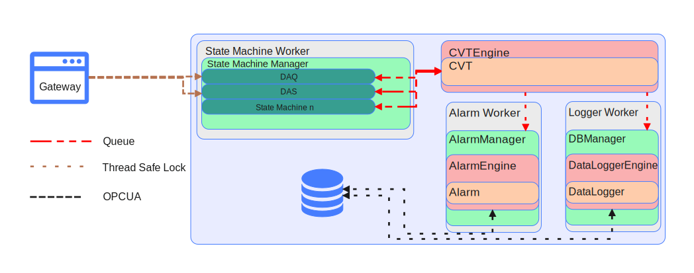

# PyAutomation

The development intention of this framework is to provide the ability to develop industrial applications where processes need to be executed concurrently and field data need to be managed for monitoring, control, and supervision applications.




In the image above, you can generally see the architecture and interaction of the different modules that make up the framework.

For this, state machines are available that run in the background and concurrently to acquire data by query (DAQ), Acquire Data by Exception (DAS) and any other general purpose state machine.

It has a memory persistence module for real-time variables that we call (CVT, Current Value Table).

There is also an alarm management system

And finally, the disk persistence of the variables to provide functionalities for historical trends of the field variables.


# Run Config Page

## Crearte Virtual Environment

```python
python3 -m venv venv
. venv/bin/activate
```
## Install Dependencies

```python
pip install --upgrade pip
pip install -r requirements.txt
```

## Run Config page

```python
python run.py
```

or 

```python

./docker-entrypoint.sh
```

## Deploy documentation on Development mode With mkautodoc

### Install Wheel

```python
pip install wheel
```

### Create PyAutomation's package

Execute this code where is setup.py file

```python
python3 setup.py bdist_wheel
```

This create some folders

- build
- dist
- PyAutomation.egg-info

### Install PyAutomation Folder

Located into "dist" folder

```python
pip install dist/PyAutomation-1.0.0-py3-none-any.whl
```

After that, you can run mkdocs serve


# Deploy

Make the following `.env` file:

```
REACT_VERSION=18.2.0
PORT=5000
```

## Docker

Export environment variables

```
export $(grep -v '^#' .env | xargs)
```

Start the app

```
sudo docker run -d \
  --name PyAutomation \
  -p ${PORT}:${PORT}\
  -v $(pwd)/temp/db:/app/db \
  -v $(pwd)/temp/logs:/app/logs \
  -e PORT=${PORT} \
  -e REACT_VERSION=${REACT_VERSION} \
  knowai/automation:1.0.0
```

## Docker Compose

If you want to deploy it using docker compose, make the following `docker-compose.yml` file:

```YaMl
version: '3.3'

services:

  automation:
    container_name: "PyAutomation"
    image: "knowai/automation:1.0.0"
    restart: always
    ports:
      - ${PORT}:${PORT}
    volumes:
      - ./temp/db:/app/db
      - ./temp/logs:/app/logs
    environment:
      PORT: ${PORT}
      REACT_VERSION: ${REACT_VERSION}
    healthcheck:
      test: ["CMD-SHELL", "curl --fail -s -k http://0.0.0.0:${PORT}/api/healthcheck/ || curl --fail -s -k https://0.0.0.0:${PORT}/api/healthcheck/ || exit 1"]
      interval: 15s
      timeout: 10s
      retries: 3

```

Start the docker compose file

```
sudo docker-compose --env-file .env up -d
```


Go to http://host:${PORT} to view the config page