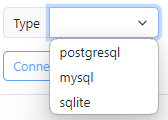

# Database

In this database module, we have the ability to connect to an existing database. To facilitate this connection, we will first select the type of database we wish to use. Next, we will need to enter key information, such as the database name, the host where it is located, the connection port, as well as the access credentials, which include the username and password. This process will allow us to interact with the database efficiently and effectively, ensuring that we can access the necessary information for our operations.

# Type
We can select the Database's Type

# Host
We can write the Database's Host

