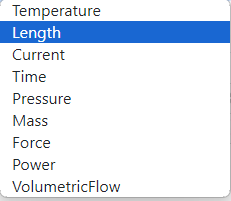
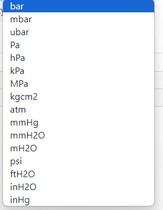

# Create TAG
- In the creation function, you will have the options:
    - Assign a name 
    - Select the variable type (whether it's Pressure, Mass Flow, or Density), 
    - Specify the corresponding units
    - Define the data type of the units 
    - Provide a description (Optional)
    - Set the Display Name (Optional)
    - Configure the OPC (Optional)
    - Node
    - Scan Time 
    - Dead Band

## Assign a name
For the creation of Tags, we can assign a name which must be unique. If the name already exists, the tag cannot be created.

We enter the Tag name.

## Variable Type
We can assign the variable type that identifies the Tag. If we select the variable type, a list of available variables is displayed.

We select the Variable Type.

## Units
When we select the variable type, the units available for selection will be related to the previously chosen variable type.

We select the units.

## DataType
We can specify the data type of the Tag through a list that displays all the available data types we can select.

We select the DataType.

## Description (Optional)
We can write a description about the Tag, but this is a optional field

## Display name
We can set a display name to easily recognize the Tag.

## OPC
We can set OPCUA Server.

## Node
We can set node

## Scan Time
We can set Scan Time

## Dead - Band
We can set Dead - Band

Note: The units in the "Dead-band" field will match the units selected earlier in the "Units" field.

So when we have all the fields ready we can click on the button "Create".

Once we click the create button, we can see our newly created tag in the dashboard.

## Export
Additionally, we can export the dashboard by clicking the "Export" button, which will download an Excel file.

